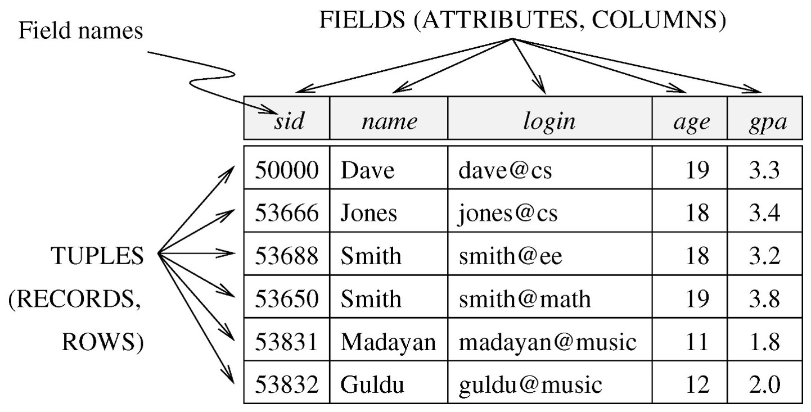

# 데이터베이스

## 2025-07-22

[Transaction processing - Wikipedia](https://en.wikipedia.org/wiki/Transaction_processing)

[Online transaction processing - Wikipedia](https://en.wikipedia.org/wiki/Online_transaction_processing)

[Online analytical processing - Wikipedia](https://en.wikipedia.org/wiki/Online_analytical_processing)

[JSON - Wikipedia](https://en.wikipedia.org/wiki/JSON)

[SQLite - Wikipedia](https://en.wikipedia.org/wiki/SQLite): 카카오톡 대화기록도 이걸 이용함

[Manufacturing execution system - Wikipedia](https://en.wikipedia.org/wiki/Manufacturing_execution_system)

[SQL - Wikipedia](https://en.wikipedia.org/wiki/SQL)

[NoSQL - Wikipedia](https://en.wikipedia.org/wiki/NoSQL)

앞으로는 DuckDB와 VectorDB가 유망할 것이다.

[Bachman diagram](https://en.wikipedia.org/wiki/Data_structure_diagram#Bachman_diagram)

[Query language - Wikipedia](https://en.wikipedia.org/wiki/Query_language)

DBMS의 중요한 가치
1. 사용자가 쿼리만 입력하면 답을 얻는 과정은 알아서 정해서 답을 구해준다. ([Query optimization](https://en.wikipedia.org/wiki/Query_optimization))
2. Concurrent access and crash recovery

수업 중에 윈도우 업데이트해서 ;;

## 2025-07-28

selection: select \* from emp where 'condition'

tuple variable
```sql
SELECT e.EMPNO form EMP e;
```

Live SQL에서 cross join의 column name이 겹치면 "No items to display"이라는 오류가 뜬다.

Live SQL에서 tuple variable에 as를 넣으면 "Unexpected symbol" 오류가 뜬다.

[Using Regular Expressions in Database Applications](https://docs.oracle.com/database/121/ADFNS/adfns_regexp.htm#ADFNS1003)

다음 퀴즈에 join query 나옴

main query와 상관이 없는 subquery를 decorrelated subquery라고 한다.

근무지가 CHICAGO인 사원을 출력

join
```sql
SELECT e.ename, d.loc
from emp e, dept d
where e.deptno = d.deptno and d.loc = 'CHICAGO'
```

```sql
select e.ename
from emp e
where e.deptno in (SELECT d.DEPTNO
from dept d
where d.loc = 'CHICAGO'
)
```

직원수 5명 이상인 dept name을 subquery로 출력
```sql
select dname from dept d where 5 <= (select count(*) from emp e where e.deptno = d.deptno)
```

## 2025-07-31

### Quiz 2 준비

**출제 범위**:
- 2.1 Relational Algebra, 2.2 Basic SQL (교수님 교안 p.39 Null Values 전까지)
- 교수님 강의 교안 및 Github에 업로드된 LiveSQL용 SQL파일에서 SQL 작성 중심의 문제 출제 예정입니다.

Basic operations
- selection ${ \sigma }$: selects a subsets of rows from relation
- projection ${ \Pi }$: deletes unwanted columns from relation
- cross-product ${ \times }$: Catrtesian product
- set-difference ${ - }$: tuples in R1 but not in R2
- union ${ \cup }$: tuples in either R1 and R2

Additional operations
- intersection
- join
- division
- renaming ${ \rho }$: resname fields
- aggregation

```sql
SELECT A1, A2, ..., An /* projection */
FROM T1,T2, ..., Tm /* Catesian Product */
WHERE P /* Selection */
```

```sql
SELECT [DISTINCT] target-list
FROM relation-list
WHERE qualification
GROUP BY grouping-list
HAVING group-qualification
```

### 수업

[OracleBlog: NULLs in Oracle](https://thinkoracle.blogspot.com/2005/06/nulls-in-oracle.html)

NULL인지 판정
```sql
IS NULL
IS NOT NULL
```

NULL = NULL -> U
U AND T -> T
U AND F -> F
U AND U -> U
U OR T -> T
U OR F -> U
U OR U -> U

요약: (U AND)는 그대로 , (U OR)은 T일 때만 T

1. where는 true인게 아니면 제거 -> unknow도 제거
2. null coulmn도 duplicate
3. +,-,\*,/는 하나라도 null이면 null
4. COUNT(\*)는 null도 센다.
5. COUNT(\*)를 제외한 모든 aggregate는 null을 무시 Count(attr)도 null을 무시.

```sql
SELECT S.sid, R.bid
WHERE S.sid = 2
```
 jones의 모든 상사를 출력하는 query생각해보기

## 요약

Four properties of Transaction: ACID
- Atomicity
- Consistency
- Isolation
- Durability

a relation made up of two parts
- Schema: relation name + name and type of each column.
- Instance: a table with rows and columns



DDL: creating relations

```SQL
CREATE TABLE Students(
	sid: CHAR(20)
	name: CHAR(10)
	age: INTERGER,
	gpa: REAL
	)
```

DML: modifying relations
- insert, delete, update, select(=query)

keys
- primary key: `PRIMARY KEY (sid)`
- candidate key: `UNIQUE (cid, grad)`
- foreign key: `FOREIN (sid) REFERENCES Students`

views: security

```sql
CREATE VIEW HighScoreStudents(sid, gpa)
	AS SELECT S.sid, S.gpa
	FROM Students S
	WHERE S.gpa > 3.5
```

materialized views (MVs): stored views

Relational Model: Summary
- Structure: A tabular representation of data.
- Operation: Powerful and natural query languages exist.
- Constratints: Integrity constraints can be specified by the DBA, based on application semantics. DBMS checks for violations.
  - Two important ICs: PK, FK
  - domain constraints.

Aggregate Operators

- COUNT(\*)
- COUNT(\[DISTINCT\] A)
- SUM(\[DISTINCT\] A)
- AVG(\[DISTINCT\] A)
- MAX(A)
- MIN(A)

NULL Values

NULL = NULL -> U
U AND T -> T
U AND F -> F
U AND U -> U
U OR T -> T
U OR F -> U
U OR U -> U

GROUP BY ROLLUP

GROUP BY CUBE

grouping(job) as T1